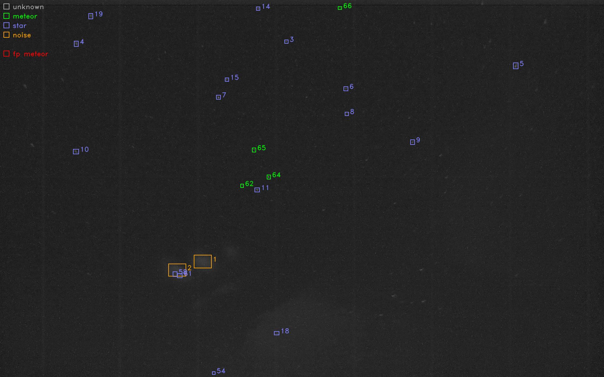

# Fast Meteor Detection Toolbox

[](https://readthedocs.org/projects/fmdt/)

## Purpose

*Fast Meteor Detection Toolbox* or **FMDT** is a toolbox **designed to detect 
meteors**. FMDT is foreseen to be applied to airborne camera systems, e.g. in 
atmospheric balloons or aircraft. **It is robust to camera movements by a motion 
compensation algorithm.**

**FMDT is ready for real-time processing on small boards like Raspberry Pi 4** 
or Nvidia Jetson Nano for embedded systems. For instance, on the Raspberry Pi 4 
(@ 1.5 GHz), FMDT is able to compute **30 frames per second** on a HD video 
sequence while the instant power is only **around 4 Watts**.



## Dependencies

This project uses `ffmpeg-io`, `nrc2`, `c-vector` and `streampu` projects as 
Git submodules, **you need to download them with the following command**:

```bash
git submodule update --init --recursive
```

Note that `ffmpeg-io` requires the `ffmpeg` executable: **you need to install 
`ffmpeg` on your system** if you want to be able to read video files.
In addition, if you want to enable text indications in generated videos/images, 
the `OpenCV` library is required.

On Debian like systems you can easily install these packages with the `apt` 
package manager:
```bash
sudo apt install ffmpeg libopencv-dev
```

## Compilation with CMake

```bash
mkdir build
cd build
cmake .. -DFMDT_OPENCV_LINK=ON -DFMDT_SPU_RUNTIME=ON -DCMAKE_BUILD_TYPE=RelWithDebInfo -DCMAKE_CXX_FLAGS_RELWITHDEBINFO="-O3 -g" -DCMAKE_C_FLAGS_RELWITHDEBINFO="-O3 -g" -DCMAKE_CXX_FLAGS="-Wall -funroll-loops -fstrict-aliasing -march=native" -DCMAKE_C_FLAGS="-funroll-loops -fstrict-aliasing -march=native"
make -j4
```

## Examples of Use

Download a video sequence containing meteors here: 
https://perso.lip6.fr/adrien.cassagne/data/tauh/in/2022_05_31_tauh_34_meteors.mp4.

### Meteors Detection

Run the meteors detection on the previous video sequence:

```shell
./bin/fmdt-detect --vid-in-path ./2022_05_31_tauh_34_meteors.mp4
```

Write tracks and bounding boxes into text files for visualization (`fmdt-visu`):

```shell
./bin/fmdt-detect --vid-in-path ./2022_05_31_tauh_34_meteors.mp4 --log-path ./detect_log --trk-roi-path ./tracks_2_rois.txt
./bin/fmdt-log-parser --log-path ./detect_log --trk-roi-path ./tracks_2_rois.txt --trk-path ./out_detect_tracks.txt --trk-bb-path ./out_detect_bb.txt
```

### Visualization

Run the visualization tool to output a video sequence with highlighted 
detection:

```shell
./bin/fmdt-visu --vid-in-path ./2022_05_31_tauh_34_meteors.mp4 --trk-path ./out_detect_tracks.txt --trk-bb-path ./out_detect_bb.txt --vid-out-path out_visu.mp4
```

## User and Developer Documentation

The documentation of this project is hosted by Read the Docs:
  - https://fmdt.readthedocs.io

To compile the documentation from the sources, refer to the readme file in the 
`./doc/` folder.

## List of Contributors

This toolbox is mainly developed by the [LIP6](https://www.lip6.fr/) laboratory 
([ALSOC](https://www.lip6.fr/recherche/team.php?acronyme=ALSOC) team) of 
[Sorbonne University](https://www.sorbonne-universite.fr/) in Paris. Some parts 
are also developed by the [IMCCE](https://www.imcce.fr/) institute 
(*l'Observatoire de Paris*). Any external contributions are more than welcome.

**Active contributors:**
 * Maxime MILLET, *PhD student*
 * Nathan MAURICE, *PhD student*
 * [Adrien CASSAGNE](https://perso.lip6.fr/adrien.cassagne/), *Associate professor*
 * [Fabian ZANDER](https://staffprofile.usq.edu.au/profile/fabian-zander), *Associate professor*
 * [Jérémie VAUBAILLON](https://www.cnrs.fr/fr/personne/jeremie-vaubaillon), *Astronomer*
 * [Lionel LACASSAGNE](https://perso.lip6.fr/Lionel.Lacassagne/), *Full professor*

**Former contributors:**
 * Florian LEMAÎTRE, *PhD*
 * Arthur HENNEQUIN, *PhD*
 * Clara CIOCAN, *Master student*
 * Mathuran KANDEEPAN, *Master student*
