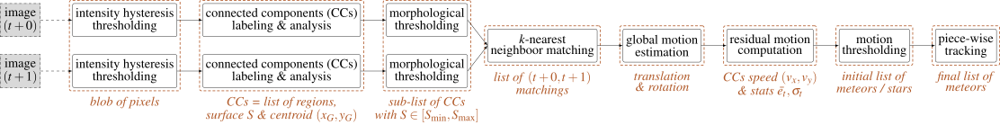

# FMDT -- *Fast Meteor Detection Toolbox*

## Contents

[1. Purpose and Scientific Background](#purpose-and-scientific-background)  
[2. Dependencies](#dependencies)  
[3. Compilation with CMake](#compilation-with-cmake)  
[3.1. CMake Options](#cmake-options)  
[4. User Documentation](#user-documentation)  
[4.1. Detection Executable](#detection-executable)  
[4.2. Visualization Executable](#visualization-executable)  
[4.3. Checking Executable](#checking-executable)  
[4.4. Max-reduction Executable](#max-reduction-executable)  
[4.6. Examples of use](#examples-of-use)  
[4.7. Input and Output Text Formats](#input-and-output-text-formats)  
[5. List of Contributors](#list-of-contributors)

## Purpose and Scientific Background

*Fast Meteor Detection Toolbox* or **FMDT** is derived from a software which was 
**designed to detect meteors** on board ISS or a Cubesat. FMDT is foreseen to be 
applied to airborne camera systems, e.g. in atmospheric balloons or aircraft. 
**It is robust to camera movements by a motion compensation algorithm.**

**FMDT is ready for real-time processing on small boards like Raspberry Pi 4** 
or Nvidia Jetson Nano for embedded systems. For instance, on the Raspberry Pi 4 
(@ 1.5 GHz), FMDT is able to compute **30 frames per second** on a HD video 
sequence while the instant power is only **around 4 Watts**.



The previous figure presents the whole FMDT's detection chain. For each pair of 
images, **an intensity hysteresis threshold**, **a connected component 
labeling and an analysis algorithm** are applied to get a list of connected 
components (CCs) with their bounding boxes and surface. Moreover, it also 
provides the first raw moments to compute the centroid $(x_G,y_G)=(S_x/S,S_y/S)$ 
of each blob of pixels. **A morphological threshold** is then done on the 
surface $S$ to reject small and big CCs. **A $k$-nearest neighbour (k-NN) 
matching** is applied to extract pairs of CCs from image $I_{t+0}$ and $I_{t+1}$ 
with $t$ the image number in the video sequence. These matches are used to 
perform **a first global motion estimation** (rigid registration). Note that CCs 
are sometimes refered as regions of interest (ROIs) in this documentation.

This motion estimation is used to classify the CCs into two classes - still 
stars or moving meteors according to the following criterion: 
$|e_k-\bar{e_t}| > \sigma_t$ with $e_k$ the compensation error of the CC number 
$k$, $\bar{e_t}$ the average error of compensation of all CCs of image $I_t$ and 
$\sigma_t$ the standard deviation of the error. **A second motion estimation** 
is done with only still star CCs, to get a more accurate motion estimation and a 
more robust classification. Finally **a piece-wise tracking** is done by 
extending the $(t+0,t+1)$ matching with $(t+1,t+2)$ matching (and so on) to 
reduce the amount of false positive detection.

## Dependencies

This project uses `ffmpeg-io`, `nrc2`, `c-vector` and `aff3ct-core` projects as 
Git submodules, **you need to download them with the following command**:

```bash
git submodule update --init --recursive
```

Note that `ffmpeg-io` requires the `ffmpeg` executable: **you need to install 
`ffmpeg` on your system** if you want to be able to read video files.
In addition, if you want to enable text indications in generated videos/images, 
the `OpenCV` library is required.

On Debian like systems you can easily install these packages with the `apt` 
package manager:
```bash
sudo apt install ffmpeg libopencv-dev
```

On macOS, we recommend you to use the `homebrew` package manager:
```bash
brew install ffmpeg opencv
```

## Compilation with CMake

```bash
mkdir build
cd build
cmake ..
make -j4
```

Note that the previous CMake command (`cmake ..`) will generate a Makefile 
without any compiler flag. If you are using a GNU or Clang compiler like, **it 
is advised to use the following CMake command line** instead:
```bash
cmake .. -DFMDT_OPENCV_LINK=ON -DFMDT_AFF3CT_RUNTIME=ON -DCMAKE_BUILD_TYPE=RelWithDebInfo -DCMAKE_CXX_FLAGS_RELWITHDEBINFO="-O3 -g" -DCMAKE_CXX_FLAGS="-Wall -funroll-loops -fstrict-aliasing -march=native"
```

**Tips**: on Apple Silicon M1 CPUs and with Apple Clang, use `-mcpu=apple-m1` 
instead of `-march=native`.

The previous command line will generate a Makefile in **release mode** (with 
debug information `-g`). It will produce optimized and ready for debug binaries.
Moreover, OpenCV and AFF3CT libraries will be used during the compilation. It 
enables advanced features (see the [CMake Options](#cmake-options) section for 
more details about it).

### CMake Options

The `CMake` file comes with several options:
 * `-DFMDT_DETECT_EXE`     [default=`ON`]  {possible:`ON`,`OFF`}: compile the 
   detection chain executable.
 * `-DFMDT_VISU_EXE`       [default=`ON`]  {possible:`ON`,`OFF`}: compile the 
   visual tracking executable.
 * `-DFMDT_CHECK_EXE`      [default=`ON`]  {possible:`ON`,`OFF`}: compile the 
   check executable.
 * `-DFMDT_MAXRED_EXE`     [default=`ON`]  {possible:`ON`,`OFF`}: compile the 
   max reduction executable.
 * `-DFMDT_DEBUG`          [default=`OFF`] {possible:`ON`,`OFF`}: build the 
   project using debugging prints: these additional prints will be output on 
   `stderr` and prefixed by `(DBG)`.
 * `-DFMDT_OPENCV_LINK`    [default=`OFF`] {possible:`ON`,`OFF`}: link with 
   OpenCV library (required to enable `--show-id` option in `fmdt-xxx` 
   executables).
 * `-DFMDT_AFF3CT_RUNTIME` [default=`OFF`] {possible:`ON`,`OFF`}: link with 
   AFF3CT runtime and produce multi-threaded detection executable 
   (`fmdt-detect-rt`).

## User Documentation

This project generates different executables:
  - `fmdt-detect` (and `fmdt-detect-rt*` if `-DFMDT_AFF3CT_RUNTIME` is set to 
    `ON`): meteors detection chain.
  - `fmdt-visu`: visualization of the detected meteors.
  - `fmdt-check`: validation of the detected meteors with the field truth.
  - `fmdt-maxred`: max reduction of grayscale pixels on a video.

The next sub-sections describe *how to use* the generated executables.

### Detection Executable

The meteors detection chain is located here: `./exe/fmdt-detect`.

The list of available arguments:

| **Argument**       | **Deprecated**     | **Type** | **Default** | **Req** | **Description** |
| :---               | :---               | :---     | :---        | :---    | :--- |
| `--vid-in-path`    | `--in-video`       | str      | None        | Yes     | Input video path (supports also a path to a sequence of images `path/basename_%05d.jpg`). |
| `--vid-in-start`   | `--fra-start`      | int      | 0           | No      | First frame id (included) to start the detection in the video sequence. |
| `--vid-in-stop`    | `--fra-end`        | int      | 0           | No      | Last frame id (included) to stop the detection in the video sequence. If set to 0, read entire video. |
| `--vid-in-skip`    | `--fra-skip`       | int      | 0           | No      | Number of frames to skip. |
| `--vid-in-buff`    | `--video-buff`     | bool     | -           | No      | Bufferize all the video in global memory before executing the chain. |
| `--vid-in-loop`    | `--video-loop`     | int      | 1           | No      | Number of times the video is read in loop. |
| `--vid-in-threads` | `--ffmpeg-threads` | int      | 0           | No      | Select the number of threads to use to decode video input (in `ffmpeg`). If set to 0, `ffmpeg` chooses the number of threads automatically. |
| `--ccl-hyst-lo`    | `--light-min`      | int      | 55          | No      | Minimum light intensity for hysteresis threshold (grayscale [0;255]). |
| `--ccl-hyst-hi`    | `--light-max`      | int      | 80          | No      | Maximum light intensity for hysteresis threshold (grayscale [0;255]). |
| `--ccl-fra-path`   | `--out-frames`     | str      | None        | No      | Path of the files for CC debug (`path/cc_%05d.png`). |
| `--ccl-fra-id`     | `--show-id`        | bool     | -           | No      | Show the ROI/CC ids on the output frames (to combine with `--ccl-fra-path` parameter). Requires to link with OpenCV library (`-DFMDT_OPENCV_LINK` CMake option). |
| `--mrp-s-min`      | `--surface-min`    | int      | 3           | No      | Minimum surface of the CCs in pixels. |
| `--mrp-s-max`      | `--surface-max`    | int      | 1000        | No      | Maximum surface of the CCs in pixels. |
| `--knn-k`          | `-k`               | int      | 3           | No      | Maximum number of neighbors considered in k-nearest neighbor matching (k-NN algorithm). |
| `--knn-d`          | `--max-dist`       | int      | 10          | No      | Maximum distance in pixels between two images (k-NN algorithm). |
| `--knn-s`          | `--min-ratio-s`    | int      | 0.125       | No      | Minimum surface ratio to match two CCs in k-NN (0 matches alls, 1 matches nothing). This parameter is also used for extrapolation in the tracking. |
| `--trk-ext-d`      | `--r-extrapol`     | int      | 10          | No      | Search radius in pixels for CC extrapolation (piece-wise tracking). |
| `--trk-ext-o`      | `--extrapol-order` | int      | 3           | No      | Maximum number of frames to extrapolate for lost objects (linear extrapolation). |
| `--trk-angle`      | `--angle-max`      | float    | 20.0        | No      | Tracking max angle between two meteors at t-1 and t (in degree). |
| `--trk-star-min`   | `--fra-star-min`   | int      | 15          | No      | Minimum number of frames required to track a star. |
| `--trk-meteor-min` | `--fra-meteor-min` | int      | 3           | No      | Minimum number of frames required to track a meteor. |
| `--trk-meteor-max` | `--fra-meteor-max` | int      | 100         | No      | Maximum number of frames required to track a meteor. |
| `--trk-ddev`       | `--diff-dev`       | float    | 4.0         | No      | Multiplication factor of the standard deviation (CC error has to be higher than `ddev` x `stddev` to be considered in movement). |
| `--trk-all`        | `--track-all`      | bool     | -           | No      | By default the program only tracks `meteor` object type. If `--track-all` is set, all object types are tracked (`meteor`, `star` or `noise`). |
| `--trk-bb-path`    | `--out-bb`         | str      | None        | No      | Path to the bounding boxes file required by `fmdt-visu` to draw detection rectangles. |
| `--trk-mag-path`   | `--out-mag`        | str      | None        | No      | Path to the output file containing magnitudes of the tracked objects. |
| `--log-path`       | `--out-stats`      | str      | None        | No      | Path of the output statistics, only required for debugging purpose. |

Output text formats are detailed in the 
[Input and Output Text Formats](#input-and-output-text-formats) section.

### Visualization Executable

The meteors visualization program is located here: `./exe/fmdt-visu`.

The list of available arguments:

| **Argument**       | **Type** | **Default**    | **Req** | **Description** |
| :---               | :---     | :---           | :---    | :--- |
| `--in-video`       | str      | None           | Yes     | Input video path (supports also a path to a sequence of images `path/basename_%05d.png`). |
| `--in-tracks`      | str      | None           | Yes     | The tracks file corresponding to the input video (generated from `fmdt-detect`). |
| `--in-bb`          | str      | None           | Yes     | The bounding boxes file corresponding to the input video (generated from `fmdt-detect`). |
| `--in-gt`          | str      | None           | No      | File containing the ground truth. |
| `--out-video`      | str      | None           | No      | Path of the output video (supports also a path to a sequence of images `path/basename_%05d.jpg`) with meteor tracking colored rectangles. If `--in-gt` is set then the bounding rectangles are red if *false positive* meteor and green if *true positive* meteor. |
| `--show-id`        | bool     | -              | No      | Show the object ids on the output video and frames. Requires to link with OpenCV library (`-DFMDT_OPENCV_LINK` CMake option). |
| `--nat-num`        | bool     | -              | No      | Natural numbering of the object ids, work only if `--show-id` is set. |
| `--only-meteor`    | bool     | -              | No      | Show only meteors. |
| `--ffmpeg-threads` | int      | 0              | No      | Select the number of threads to use to decode video input (in `ffmpeg`). If set to 0, `ffmpeg` chooses the number of threads automatically. |
| `--fra-start`      | int      | 0              | No      | First frame id (included) to start the visualization in the video sequence. |
| `--fra-end`        | int      | 0              | No      | Last frame id (included) to stop the visualization in the video sequence. If set to 0, read entire video. |

**Note**: to run `fmdt-visu`, it is required to run `fmdt-detect` before and on 
the same input video. This will generate the required `tracks.txt` and 
`bounding_box.txt` files.

Input text formats are detailed in the 
[Input and Output Text Formats](#input-and-output-text-formats) section.

### Checking Executable

The meteors checking program is located here: `./exe/fmdt-check`.

The list of available arguments:

| **Argument**  | **Type** | **Default** | **Req** | **Description** |
| :---          | :---     | :---        | :---    | :--- |
| `--in-tracks` | str      | None        | Yes     | The track file corresponding to the input video (generated from `fmdt-detect`). |
| `--in-gt`     | str      | None        | Yes     | File containing the ground truth. |

**Note**: to run `fmdt-check`, it is required to run `fmdt-detect` before. This 
will generate the required `tracks.txt` file.

Input/output text formats are detailed in the 
[Input and Output Text Formats](#input-and-output-text-formats) section.

### Max-reduction Executable

The max-reduction generation program is located here: `./exe/fmdt-maxred`.

The list of available arguments:

| **Argument**       | **Type** | **Default** | **Req** | **Description** |
| :---               | :---     | :---        | :---    | :--- |
| `--in-video`       | str      | None        | Yes     | Input video path (supports also a path to a sequence of images `path/basename_%05d.png`). |
| `--in-tracks`      | str      | None        | No      | The tracks file corresponding to the input video (generated from `fmdt-detect`). |
| `--in-gt`          | str      | None        | No      | File containing the ground truth. |
| `--out-frame`      | str      | None        | Yes     | Path of the output frame. |
| `--fra-start`      | int      | 0           | No      | First frame id (included) to start the max-reduction in the video sequence. |
| `--fra-end`        | int      | 0           | No      | Last frame id (included) to stop the max-reduction in the video sequence. If set to 0, read entire video. |
| `--show-id`        | bool     | -           | No      | Show the object ids on the output video and frames, works only if `--in-tracks` is set. Requires to link with OpenCV library (`-DFMDT_OPENCV_LINK` CMake option). |
| `--nat-num`        | bool     | -           | No      | Natural numbering of the object ids, works only if `--show-id` is set. |
| `--only-meteor`    | bool     | -           | No      | Show only meteors. |
| `--ffmpeg-threads` | int      | 0           | No      | Select the number of threads to use to decode video input (in `ffmpeg`). If set to 0, `ffmpeg` chooses the number of threads automatically. |

### Examples of use

Download a video sequence containing meteors here: 
https://lip6.fr/adrien.cassagne/data/tauh/in/2022_05_31_tauh_34_meteors.mp4.
These video sequence comes from IMCCE (*l'Observatoire de Paris*) and is the 
result of an airborne observation of the 2022 τ-Herculids. More information 
about the 2022 τ-Herculids is available here: 
https://www.imcce.fr/recherche/campagnes-observations/meteors/2022the.

#### Step 1: Meteors detection

```shell
./exe/fmdt-detect --vid-in-path ./2022_05_31_tauh_34_meteors.mp4
```

Write tracks and bounding boxes into text files for `fmdt-visu` and 
`fmdt-check`:

```shell
./exe/fmdt-detect --vid-in-path ./2022_05_31_tauh_34_meteors.mp4 --trk-bb-path ./out_detect_bb.txt > ./out_detect_tracks.txt
```

#### Step 2: Visualization

Visualization **WITHOUT** ground truth:

```shell
./exe/fmdt-visu --in-video ./2022_05_31_tauh_34_meteors.mp4 --in-tracks ./out_detect_tracks.txt --in-bb ./out_detect_bb.txt --out-video out_visu.mp4
```

Visualization **WITH** ground truth:

```shell
./exe/fmdt-visu --in-video ./2022_05_31_tauh_34_meteors.mp4 --in-tracks ./out_detect_tracks.txt --in-bb ./out_detect_bb.txt --in-gt ../validation/2022_05_31_tauh_34_meteors.txt --out-video out_visu.mp4
```

#### Step 3: Offline checking

Use `fmdt-check` with the following arguments:

```shell
./exe/fmdt-check --in-tracks ./out_detect_tracks.txt --in-gt ../validation/2022_05_31_tauh_34_meteors.txt
```

#### Step 4: Max reduction

Use `fmdt-maxred` with the following arguments:

```shell
./exe/fmdt-maxred --in-video ./2022_05_31_tauh_34_meteors.mp4 --out-frame out_maxred.pgm
```

### Input and Output Text Formats

This section details the various text formats used by the toolchain.
For each text format, the `#` character can be used for comments (at the 
beginning of a new line).

#### Tracks: `stdout` of `fmdt-detect` / `--in-tracks` in `fmdt-visu` and `fmdt-check`

The tracks represent the detected objects in the video sequence.

```
# -------||---------------------------||---------------------------||---------
#  Track ||           Begin           ||            End            ||  Object
# -------||---------------------------||---------------------------||---------
# -------||---------|--------|--------||---------|--------|--------||---------
#     Id || Frame # |      x |      y || Frame # |      x |      y ||    Type
# -------||---------|--------|--------||---------|--------|--------||---------
   {tid} ||  {fbeg} | {xbeg} | {ybeg} ||  {fend} | {xend} | {yend} || {otype}
```

* `{tid}`: a positive integer (start to 1) value representing a unique track 
  identifier.
* `{fbeg}`: a positive integer value representing the first frame in the video 
  sequence when the track is detected.
* `{xbeg}`: a positive real value of the x-axis coordinate (beginning of the 
  track).
* `{ybeg}`: a positive real value of the y-axis coordinate (beginning of the 
  track).
* `{fend}`: a positive integer value representing the last frame in the video 
  sequence when the track is detected.
* `{xend}`: a positive real value of the x-axis coordinate (end of the track).
* `{yend}`: a positive real value of the y-axis coordinate (end of the track).
* `{otype}`: a string of the object type, can be: `meteor`, `star` or `noise`.

#### Bounding Boxes: `--trk-bb-path` in `fmdt-detect` / `--in-bb` in `fmdt-visu`

The bounding boxes can be output by `fmdt-detect` (with the `--out-bb` argument) 
and are required by `fmdt-visu`. Each bounding box defines the area of an 
object, frame by frame.

Here is the corresponding line format:
```
{frame_id} {x_radius} {y_radius} {center_x} {center_y} {track_id} {is_extrapolated}
```
Each line corresponds to a frame and to an object, each value is separated by a 
space character.

#### Magnitudes: `--trk-mag-path` in `fmdt-detect`

The magnitudes can be output by `fmdt-detect` (with the `--out-mag` argument) 
and can be used for astrophotometry. For instance they are used as input in 
[pyFMDT](pyFMDT/README.md).

Each line corresponds to a track/object and here is the corresponding line 
format:
```
{tid} {otype} {mag1} {mag2} {...} {magn}
```

`mag1` is the first magnitude value of the track/object of `tid` id. `mag2` is 
the second magnitude value (in the second frame where the object has been 
tracked). And so on, until the last magnitude value `magn`. Note that sometime 
the magnitude value can be `0`, it means that the object has been extrapolated 
on this frame, thus the magnitude cannot be computed.

#### Ground Truth: `--in-gt` in `fmdt-visu`, `fmdt-check` & `fmdt-maxred`

Ground truth file gives objects positions over time. Here is the expected text 
format of a line:

```
{otype} {fbeg} {xbeg} {ybeg} {fend} {xend} {yend}
```

`{otype}` can be `meteor`, `star` or `noise`.
`{fbeg}` and `{fend}` stand for `frame begin` and `frame end`.
`{xbeg}` and `{ybeg}` stand for `x` and `y` coordinates of the `frame begin`.
`{xend}` and `{yend}` stand for `x` and `y` coordinates of the `frame end`.
`{fbeg}`, `{xbeg}`, `{ybeg}`, `{fend}`, `{xend}`, `{yend}` are positive 
integers. Each line corresponds to an object and each value is separated by a 
space character.

#### Check Report: `stdout` in `fmdt-check`

The first part of `fmdt-check` `stdout` is a table where each entry corresponds 
to an object of the ground truth (GT):

```
# ---------------||---------------||-----------------||--------
#    GT Object   ||      Hits     ||    GT Frames    || Tracks
# ---------------||---------------||-----------------||--------
# -----|---------||--------|------||--------|--------||--------
#   Id |    Type || Detect |  GT  ||  Start |  Stop  ||      #
# -----|---------||--------|------||--------|--------||--------
 {tid} | {otype} ||   {dh} | {gh} || {staf} | {stof} ||   {nt}
```

* `{tid}`: a positive integer value representing a unique identifier of ground 
  truth track/object.
* `{otype}`: a string of the object type, can be: `meteor`, `star` or `noise`.
* `{dh}`: a positive integer value of the number of frames when the object is 
  detected (from the tracks, `--in-tracks`).
* `{gh}`: a positive integer value of the number of frame when the object is 
  present (from the ground truth, `--in-gt`).
* `{staf}`: a positive integer value of the frame start (from the ground truth, 
  `--in-gt`).
* `{stof}`: a positive integer value of the frame stop (from the ground truth, 
  `--in-gt`).
* `{nt}`: a positive integer value of the number of tracks that match the ground 
  truth object.

In a second part, `fmdt-check` `stdout` gives some statistics in the following 
format (`{pi}` stands for *positive integer* and `{pf}` for *positive float*):

```
Statistics:
  - Number of GT objs = ['meteor': {pi}, 'star': {pi}, 'noise': {pi}, 'all': {pi}]
  - Number of tracks  = ['meteor': {pi}, 'star': {pi}, 'noise': {pi}, 'all': {pi}]
  - True positives    = ['meteor': {pi}, 'star': {pi}, 'noise': {pi}, 'all': {pi}]
  - False positives   = ['meteor': {pi}, 'star': {pi}, 'noise': {pi}, 'all': {pi}]
  - True negative     = ['meteor': {pi}, 'star': {pi}, 'noise': {pi}, 'all': {pi}]
  - False negative    = ['meteor': {pi}, 'star': {pi}, 'noise': {pi}, 'all': {pi}]
  - Tracking rate     = ['meteor': {pf}, 'star': {pf}, 'noise': {pf}, 'all': {pf}]
```

* `Number of GT objs`: the number of objects from the ground truth.
* `Number of tracks`: the number of objects from the tracks (`fmdt-detect` 
  output).
* `True positives`: number of detected objects that are in the ground truth 
  (with the same type).
* `False positives`: number of detected objects that are not in the ground truth 
  (or that have a different type).
* `True negative`: number of detected objects that are different from the 
  current type of object. For instance, if we focus on `meteor` object type, the 
  number of false negatives is the sum of all the objects in the tracks that are 
  `star` or `noise`.
* `False negative`: number of non-detected objects (present in the ground truth 
  and not present in the tracks).
* `Tracking rate`: the sum of detected hits on the sum of the ground truth hits. 
  Range is between 1 (perfect tracking) and 0 (nothing is tracked). When there 
  are more hits in a track than in the ground truth, the detected hits are the 
  ground truth hits minus the extra hits of the track.

For each line, the `meteor`, `star` and `noise` object types are considered.
`all` stands for all types, sometime `all` can be mean-less.

#### Logs / Statistics: `--log-path` in `fmdt-detect`

**This section targets advanced users, some knowledge about the implemented 
algorithms may be required!! You have been warned ;-).**

`fmdt-detect` comes with the `--out-stats` option to help to understand what is 
happening during the execution.
This option enables to log internal statistics of the different algorithms used 
to detect meteors.

The folder contains multiple files, one per frame. For instance, the file name 
for the frame n°12 is: `00012.txt`. Each file contains 5 different tables:
  - Table 1: list of Regions Of Interest (ROIs) at `t - 1` (result of the 
    CCL/CCA + hysteresis algorithm at `t - 1`)
  - Table 2: list of Regions Of Interest (ROIs) at `t` (result of the CCL/CCA + 
    hysteresis algorithm at `t`)
  - Table 3: list of associations between `t - 1` ROIs and `t` ROIs (result of 
    the k-NN algorithm) + errors/velocities after motion estimation
  - Table 4: motion estimation statistics between `t - 1` and `t` frame
  - Table 5: list of tracks since the beginning of the execution (final output 
    of the detection chain)

Note that the first log file (usally named `00000.txt`) only contains the 
table 2. This is normal because algorithms stating from k-NN require two 
consecutive frames to work.

##### Table 1 and table 2: Regions Of Interest (ROIs)

```
# ------||----------------||---------------------------||---------------------------||-------------------||-----------
#   ROI ||      Track     ||        Bounding Box       ||   Surface (S in pixels)   ||      Center       || Magnitude 
# ------||----------------||---------------------------||---------------------------||-------------------||-----------
# ------||------|---------||------|------|------|------||-----|----------|----------||---------|---------||-----------
#    ID ||   ID |    Type || xmin | xmax | ymin | ymax ||   S |       Sx |       Sy ||       x |       y ||        -- 
# ------||------|---------||------|------|------|------||-----|----------|----------||---------|---------||-----------
  {rid} || {tid}| {otype} ||{xmin}|{xmax}|{ymin}|{ymax}|| {S} |     {Sx} |     {Sy} ||    {cx} |    {cy} ||      {mag}
```

Each line corresponds to one region of interest (ROI) :
  - `{rid}`: unique identifier for the current ROI (start to 1)
  - `{tid}`: unique identifier of the corresponding track (start to 1), can be 
    empty if no track is associated to the current ROI
  - `{otype}`: type of the track object (`meteor`, `noise` or `star`), only if 
    there is a track corresponding to this ROI
  - `{xmin}`: minimum x position of the bounding box
  - `{xmax}`: maximum x position of the bounding box
  - `{ymin}`: minimum y position of the bounding box
  - `{ymax}`: maximum y position of the bounding box
  - `{S}`: surface (area) of the ROI in pixels
  - `{Sx}`: sum of x properties
  - `{Sy}`: sum of y properties
  - `{cx}`: x center of mass
  - `{cy}`: y center of mass
  - `{mag}`: magnitude of the current ROI (accumulated brightness of the ROI)

##### Table 3: List of associations between ROIs

```
# --------------------||---------------||------------------------||-----------
#         ROI ID      ||    Distance   ||  Error (or velocity)   ||   Motion  
# --------------------||---------------||------------------------||-----------
# ----------|---------||--------|------||-------|-------|--------||-----------
#       t-1 |       t || pixels | rank ||    dx |    dy |      e || is moving 
# ----------|---------||--------|------||-------|-------|--------||-----------
  {rid_t-1} | {rid_t} || {dist} |  {k} ||  {dx} |  {dy} |    {e} ||      {mov}
```

Each line corresponds to an association between one ROI at `t - 1` and at `t`:
  - `{rid_t-1}`: id of the ROI in the table 1 (in the `t - 1` frame)
  - `{rid_t}` : id of the ROI in the table 2 (in the `t` frame)
  - `{dist}`: distance in pixels between the two ROIs
  - `{rank}`: rank in the k-NN algorithm, if 1: it means that this is the 
    closest ROI asso., if 2: it means that this is the second closest ROI asso., 
    etc.
  - `{dx}`: x distance between the estimated position (after motion estimation) 
    and the real position (in frame `t - 1`)
  - `{dy}`: y distance between the estimated position (after motion estimation) 
    and the real position (in frame `t - 1`)
  - `{e}`: euclidean distance between the estimated position and the real 
    position
  - `{mov}`: `yes` if the ROI is moving, `no` otherwise. The criteria to detect 
    the motion of an ROI is: abs(`{e}` - `{mean_err1}`) > `{std_dev1}`

If `{mov}` = `yes` then, `{dx}`,`{dy}` is the velocity vector and `{e}` is the 
velocity norm in pixel.

**Note that `{dx}`, `{dy}`, `{e}` and `{mov}` are computed after the second 
motion estimation.**

##### Table 4: Motion Estimation Statistics

```
# ------------------------------------------------------||------------------------------------------------------
#   First motion estimation (with all associated ROIs)  ||    Second motion estimation (exclude moving ROIs)    
# ------------------------------------------------------||------------------------------------------------------
# ----------|----------|----------|----------|----------||----------|----------|----------|----------|----------
#     theta |       tx |       ty | mean err |  std dev ||    theta |       tx |       ty | mean err |  std dev 
# ----------|----------|----------|----------|----------||----------|----------|----------|----------|----------
   {theta1} |    {tx1} |    {ty1} |{mean_er1}|{std_dev1}|| {theta2} |    {tx2} |    {ty2} |{mean_er2}|{std_dev2}
```

There is only one line in this table. It represents the motion estimation 
between frame `t - 1` and frame `t`:
  - `{theta}`: the estimated rotation angle between frame `t` and frame 
    `t - 1`
  - `{tx}` and `{ty}`: the estimated translation vector from frame `t` to frame 
    `t - 1`
  - `{mean_er}`: the mean error of the associated ROIs
  - `{std_dev}`: the standard deviation of the associated ROI errors

The first estimation considers all the associated ROIs while the second 
estimation excludes the associated ROIs in movement. To be considered in 
movement, an ROI has to verify the following condition: 
abs(`{e}` - `{mean_er1}`) > `{std_dev1}`, with `{e}` the error of the current 
ROI.

##### Table 5: List of Tracks

```
# -------||---------------------------||---------------------------||---------||-------------------
#  Track ||           Begin           ||            End            ||  Object || Reason of changed 
# -------||---------------------------||---------------------------||---------||    state (from    
# -------||---------|--------|--------||---------|--------|--------||---------||  meteor to noise  
#     Id || Frame # |      x |      y || Frame # |      x |      y ||    Type ||    object only)   
# -------||---------|--------|--------||---------|--------|--------||---------||-------------------
   {tid} ||  {fbeg} | {xbeg} | {ybeg} ||  {fend} | {xend} | {yend} || {otype} ||          {reason}
```

Most of the columns of this table have been described in a previous section, 
here we focus only on extra columns:
  - `{reason}`: reason of the classification from `meteor` to `noise`

## List of Contributors

This toolbox is mainly developed by the [LIP6](https://www.lip6.fr/) laboratory 
([ALSOC](https://www.lip6.fr/recherche/team.php?acronyme=ALSOC) team) of 
[Sorbonne University](https://www.sorbonne-universite.fr/) in Paris. Some parts 
are also developed by the [IMCCE](https://www.imcce.fr/) institute 
(*l'Observatoire de Paris*). Any external contributions are more than welcome.

**Active contributors:**
 * Clara CIOCAN, *Master student*
 * Mathuran KANDEEPAN, *Master student*
 * Maxime MILLET, *PhD student*
 * [Adrien CASSAGNE](https://lip6.fr/adrien.cassagne/), *Associate professor*
 * [Jérémie VAUBAILLON](https://www.cnrs.fr/fr/personne/jeremie-vaubaillon), *Astronomer*
 * [Lionel LACASSAGNE](https://lip6.fr/Lionel.Lacassagne/), *Full professor*

**Former contributors:**
 * Florian LEMAÎTRE, *PhD*
 * Arthur HENNEQUIN, *PhD*
