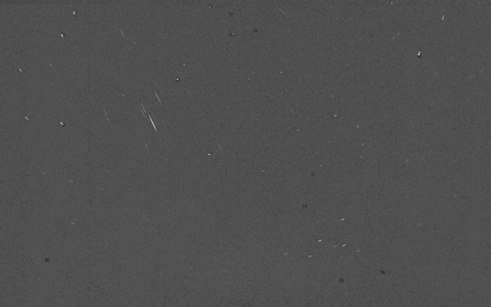

.. _user_examples_use:

***************
Examples of Use
***************

.. only:: html

	.. video:: https://perso.lip6.fr/adrien.cassagne/data/tauh/in/2022_05_31_tauh_34_meteors.mp4
	   :width: 100%

	2022 :math:`\tau`-Herculids video sequence, cluster of 34 meteors.

Download `a video sequence containing meteors here
<https://perso.lip6.fr/adrien.cassagne/data/tauh/in/2022_05_31_tauh_34_meteors.mp4>`_.
These video sequence comes from |IMCCE| (*Paris's Observatory*) and is the
result of an airborne observation of the 2022 :math:`\tau`-Herculids. More
information about the 2022 :math:`\tau`-Herculids is `available here
<https://www.imcce.fr/recherche/campagnes-observations/meteors/2022the>`_.

Meteors detection
"""""""""""""""""

.. code-block:: bash

	./bin/fmdt-detect --vid-in-path ./2022_05_31_tauh_34_meteors.mp4

Write tracks and bounding boxes into text files for ``fmdt-visu`` and
``fmdt-check``:

.. code-block:: bash

	./bin/fmdt-detect --vid-in-path ./2022_05_31_tauh_34_meteors.mp4 --log-path ./detect_log --trk-roi-path ./tracks_2_rois.txt
	./bin/fmdt-log-parser --log-path ./detect_log --trk-roi-path ./tracks_2_rois.txt --trk-path ./out_detect_tracks.txt --trk-bb-path ./out_detect_bb.txt

As you can see, first ``fmdt-detect`` is run with the :ref:`detect_log-path` and
the :ref:`detect_trk-roi-path` parameters. Then ``fmdt-log-parser`` generates
the tracks list (:ref:`log_trk-path` parameter) and the |BBs|
(:ref:`log_trk-bb-path` parameter).

Visualization
"""""""""""""

Visualization **WITHOUT** ground truth:

.. code-block:: bash

	./bin/fmdt-visu --vid-in-path ./2022_05_31_tauh_34_meteors.mp4 --trk-path ./out_detect_tracks.txt --trk-bb-path ./out_detect_bb.txt --vid-out-path out_visu.mp4

Visualization **WITH** ground truth:

.. code-block:: bash

	./bin/fmdt-visu --vid-in-path ./2022_05_31_tauh_34_meteors.mp4 --trk-path ./out_detect_tracks.txt --trk-bb-path ./out_detect_bb.txt --gt-path ../validation/2022_05_31_tauh_34_meteors.txt --vid-out-path out_visu.mp4

.. only:: html

	.. video:: https://perso.lip6.fr/adrien.cassagne/data/tauh/tracks.mp4
	   :width: 100%

	2022 :math:`\tau`-Herculids video sequence, cluster of 34 meteors **with
	highlighted detection**.

Offline checking
""""""""""""""""

Use ``fmdt-check`` with the following arguments:

.. code-block:: bash

	./bin/fmdt-check --trk-path ./out_detect_tracks.txt --gt-path ../validation/2022_05_31_tauh_34_meteors.txt

.. code-block:: bash

	#  --------------------
	# |         ----*      |
	# | --* FMDT-CHECK --* |
	# |   -------*         |
	#  --------------------
	#
	# Parameters:
	# -----------
	#  * trk-path = ./out_detect_tracks.txt
	#  * gt-path  = ../validation/2022_05_31_tauh_34_meteors.txt
	#
	# The program is running...
	# ---------------||--------------||---------------||--------
	#    GT Object   ||     Hits     ||   GT Frames   || Tracks
	# ---------------||--------------||---------------||--------
	# -----|---------||--------|-----||-------|-------||--------
	#   Id |    Type || Detect |  GT || Start |  Stop ||      #
	# -----|---------||--------|-----||-------|-------||--------
	     1 |  meteor ||      7 |   7 ||   102 |   108 ||      1
	     2 |  meteor ||     17 |  16 ||   110 |   125 ||      1
	     3 |  meteor ||      8 |   9 ||   111 |   119 ||      1
	     4 |  meteor ||      3 |   3 ||   121 |   123 ||      1
	     5 |  meteor ||      3 |   3 ||   127 |   129 ||      1
	     6 |  meteor ||      3 |   3 ||   129 |   131 ||      1
	     7 |  meteor ||      9 |  10 ||   133 |   142 ||      1
	     8 |  meteor ||     10 |  10 ||   134 |   143 ||      1
	     9 |  meteor ||      4 |   4 ||   134 |   137 ||      1
	    10 |  meteor ||      3 |   4 ||   135 |   138 ||      1
	    11 |  meteor ||      6 |  10 ||   137 |   146 ||      1
	    12 |  meteor ||      4 |   4 ||   139 |   142 ||      1
	    13 |  meteor ||     11 |  11 ||   140 |   150 ||      1
	    14 |  meteor ||      4 |   4 ||   146 |   149 ||      1
	    15 |  meteor ||      3 |   3 ||   156 |   158 ||      1
	    16 |  meteor ||     10 |  10 ||   156 |   165 ||      1
	    17 |  meteor ||      6 |   6 ||   157 |   162 ||      1
	    18 |  meteor ||      4 |   4 ||   160 |   163 ||      1
	    19 |  meteor ||      4 |   4 ||   164 |   167 ||      1
	    20 |  meteor ||      3 |   3 ||   167 |   169 ||      1
	    21 |  meteor ||      5 |   5 ||   171 |   175 ||      1
	    22 |  meteor ||      7 |   7 ||   174 |   180 ||      1
	    23 |  meteor ||      8 |   8 ||   178 |   185 ||      1
	    24 |  meteor ||     11 |  11 ||   179 |   189 ||      1
	    25 |  meteor ||      3 |   3 ||   179 |   181 ||      1
	    26 |  meteor ||      5 |   5 ||   180 |   184 ||      1
	    27 |  meteor ||      7 |   7 ||   183 |   189 ||      1
	    28 |  meteor ||      4 |   4 ||   194 |   197 ||      1
	    29 |  meteor ||      3 |   4 ||   197 |   200 ||      1
	    30 |  meteor ||      6 |   5 ||   199 |   203 ||      2
	    31 |  meteor ||      6 |   6 ||   200 |   205 ||      1
	    32 |  meteor ||      7 |   7 ||   223 |   229 ||      1
	    33 |  meteor ||      5 |   5 ||   224 |   228 ||      1
	    34 |  meteor ||      4 |   4 ||   249 |   252 ||      1
	Statistics:
	  - Number of GT objs = ['meteor':   34, 'star':    0, 'noise':    0, 'all':   34]
	  - Number of tracks  = ['meteor':   38, 'star':    0, 'noise':    0, 'all':   38]
	  - True positives    = ['meteor':   35, 'star':    0, 'noise':    0, 'all':   35]
	  - False positives   = ['meteor':    3, 'star':    0, 'noise':    0, 'all':    3]
	  - True negative     = ['meteor':    0, 'star':   38, 'noise':   38, 'all':   76]
	  - False negative    = ['meteor':    0, 'star':    0, 'noise':    0, 'all':    0]
	  - tracking rate     = ['meteor': 0.95, 'star':  nan, 'noise':  nan, 'all': 0.95]
	# End of the program, exiting.

Max-reduction
"""""""""""""

Use ``fmdt-maxred`` with the following arguments:

.. code-block:: bash

	./bin/fmdt-maxred --vid-in-path ./2022_05_31_tauh_34_meteors.mp4 --fra-out-path out_maxred.pgm

.. _fig_maxred_image:

   Max-reduction image of the 2022 :math:`\tau`-Herculids video sequence.
